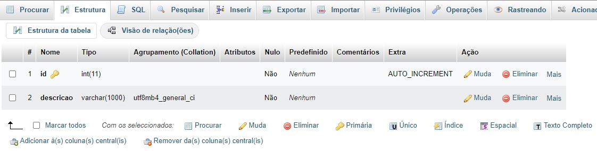

# Aulo10AplicDB - correto Aula 12
http://localhost/aulo10aplicdb/

Instenções 

- PHP Awesome Snippets
- PHP Intelephense

 Aplicação com Banco de dados

 # Aula 12
 > Criar uma aplicação para cadastrp de tarefas.

 ## Conexão com banco de dados

 Para uma conexão com o BD é encessário saber:
 - endereço do servidor de banco de dados(127.0.0.1 ou localhost)
 - nome do banca de dados (bd_tarefas)
 - usuário do banco de dados (root)
 - senha do banco de dados (não tem)
 
 ## Requisitos funcionais
 ### ToDO
 A aplicação deve possibilitar:
 - Lista de todas as tarefas
 - Cadastrar uma nova tarefa
 - Alterar uma tarefa existente
 - Excluir uma terefa existente

### Backlog
- Adicionar nome do responsável da tarefa
- Data de início e fim da tarefa (previsto)
- Status da Tarefa (Planejado, Em adamento, Concluído)
- Consulta das tarefas por status
- Consulta por data
- Data de fim realizado
- Destaque nas tarefas no dia atual
- Modo de visualização de calendário

- Colocar um campo de Título

## Banco
